<p align="center">
  <a href="https://launchblocks.aivylabs.xyz">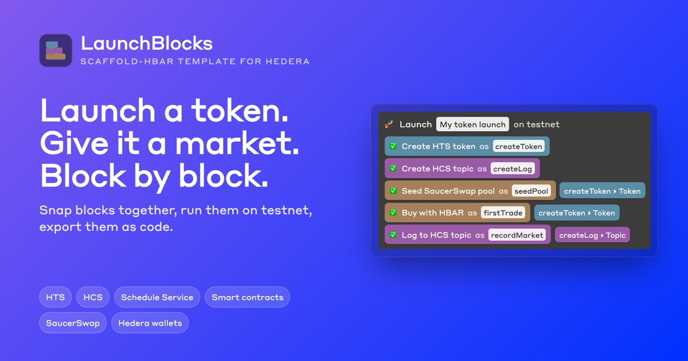</a>
</p>

# LaunchBlocks — a visual token launchpad for Hedera

[](https://launchblocks.aivylabs.xyz)
[](https://github.com/jmgomezl/scaffold-hbar-launchblocks/actions/workflows/ci.yaml)
[](https://github.com/jmgomezl/scaffold-hbar-launchblocks/actions/workflows/fresh-scaffold.yaml)
[](LICENSE)


A [Scaffold-HBAR](https://docs.hedera.com/solutions/tools/scaffold-hbar/index) template for launching a token and giving it a market in one go. Snap blocks together — **create an HTS token → open a public HCS launch log → seed a SaucerSwap pool → make the first trade** — press Run, and watch each block turn green as its transaction reaches consensus. Then lock the pool's liquidity in a contract, or schedule supply unlocks the network runs on a date. The same launch runs from the terminal, exports as a `launch.ts` script, and is stored as a plain JSON file you can review and commit.

**[Try it live at launchblocks.aivylabs.xyz](https://launchblocks.aivylabs.xyz/launch)**, on Hedera testnet. The app's funded account signs every run, so there is nothing to install, connect or fund; you can also connect your own testnet wallet in the Run panel.

```bash
npx create-scaffold-hbar@latest --template jmgomezl/scaffold-hbar-launchblocks
```


*A real run of `hts-launch-locked-liquidity` on testnet, started from the Launch Studio: a token, its launch log, a SaucerSwap pool, a `TokenLock` contract holding the pool's LP tokens, and two reads of the lock, in 36 seconds. Shown at three times speed.*

**Contents:** [What you get](#what-you-get) · [Quick start](#quick-start) · [See it in action](#see-it-in-action) · [Verified on testnet](#verified-on-testnet) · [Launch pages and share links](#launch-pages-and-share-links) · [AI agents (MCP)](#use-it-from-an-ai-agent-mcp) · [How it works](#how-it-works) · [Steps](#steps) · [SaucerSwap](#the-saucerswap-integration) · [Locking and unlocks](#locking-liquidity-and-scheduling-unlocks) · [Pyth](#pricing-a-launch-in-us-dollars-with-pyth) · [Adding a step](#adding-a-step-type) · [Hedera Harness](#extending-it-with-hedera-harness) · [Environment variables](#environment-variables) · [Scripts](#scripts) · [Deploying](#deploying-the-studio) · [Troubleshooting](#troubleshooting) · [Security notes](#security-notes)

## What you get

- **Launch Studio** (`/launch`) — a block editor in the style of App Inventor. Id and amount inputs are sockets: type a value, or drag in an output from an earlier step, such as `createToken ▸ Token` or `seedPool ▸ LP tokens received`. Problems show up on the block they belong to; runs stream live.
- **Flows as JSON** — the editor, the CLI and the API all run the same document. Nothing the editor can do is missing from the JSON.
- **A SaucerSwap integration that gets the details right** — exact opening prices, the EVM-alias recipient, fee conversion, measured gas limits. See [what makes it hard](#the-saucerswap-integration).
- **Prices in US dollars from Pyth** — **Price in USD with Pyth** works out the HBAR to pair with your tokens so the pool opens at a dollar price, from Pyth's HBAR/USD feed on Hedera. It can post a fresh signed price first, and rehearses that for free, because Pyth's Hedera contracts currently refuse fresh updates. See [pricing in US dollars](#pricing-a-launch-in-us-dollars-with-pyth).
- **Your contracts as blocks** — **Deploy contract** and **Call contract** work with any contract in `packages/hardhat`. The included `TokenLock` locks a pool's LP tokens for a set time, so holders can see the liquidity cannot be pulled.
- **Scheduled transactions** — **Schedule token transfer** and **Schedule a mint** use the Schedule Service's long-term schedules (HIP-423): vesting and supply unlocks that the network runs on their date with nobody online.
- **Fourteen step types** across HTS, HCS, the Schedule Service, smart contracts, SaucerSwap, Pyth and the mirror node, each one schema-checked, documented, tested, and exportable as code.
- **The app's account or yours** — by default the server's operator account signs and pays, so anyone can press Run with nothing to set up. A visitor can instead connect their own testnet wallet (HashPack, Kabila, or any wallet through [hedera-wallet-connect](https://github.com/hashgraph/hedera-wallet-connect)) and approve each transaction; the launch then runs in their browser, and nothing they create belongs to the app.
- **A public page for every launch** (`/launches/<topic id>`), rebuilt from the launch's own HCS log: the token, the pool's price now against its opening price, the locked liquidity and its countdown, and whether each schedule has run. The app stores nothing; the log is the record. The Run panel links to it after a run. See [launch pages](#launch-pages-and-share-links).
- **Launches you can share and price** — **Share** copies a link that opens the same blocks in anyone's studio, with the flow inside the link itself. Before a run, the Run panel says what it will cost, step by step.
- **An MCP server for coding agents** — Claude Code, Cursor or any MCP client can read the step catalog, build and validate a flow (with its cost), export `launch.ts`, hand back a studio link, dry-run or run it, and read a launch back. `.mcp.json` registers it for Claude Code. See [AI agents](#use-it-from-an-ai-agent-mcp).
- **A terminal runner** with dry runs, code generation, and a JSON record of every run, plus `core:doctor`, which checks your operator account before you spend anything.
- **Guards for a public demo** — mainnet stays off unless you turn it on, plus an optional run token and a per-client rate limit.

## Quick start

**You need:** Node.js ≥ 20.18.3, Git, and a Hedera testnet account with 60–80 ℏ for a full launch ([what it costs](#what-a-launch-costs)). If you pick the template's default package manager, run `corepack enable` once first: the project pins its version in `package.json`. The CLI installs the dependencies; after a plain `git clone`, install them yourself.

1. **Scaffold the project** (the CLI asks which package manager to use; both work) and go into it:

   ```bash
   npx create-scaffold-hbar@latest --template jmgomezl/scaffold-hbar-launchblocks
   cd <your-project>
   ```

2. **Fund an operator.** Create an **ECDSA** testnet account at [portal.hedera.com](https://portal.hedera.com/) and top it up from the [faucet](https://portal.hedera.com/faucet). Copy its account id and its **DER-encoded** private key (it starts with `3030`): a DER key says which curve it is, so it needs no `HEDERA_OPERATOR_KEY_TYPE`. ED25519 works for the app too, but the Harness recipe needs ECDSA.

3. **Configure it:**

   ```bash
   cp packages/nextjs/.env.example packages/nextjs/.env
   ```

   Replace the placeholder `HEDERA_OPERATOR_ID=0.0.xxxxx` with your account id and set `HEDERA_OPERATOR_KEY`. If the key is raw hex rather than DER, also set `HEDERA_OPERATOR_KEY_TYPE` (`ecdsa` or `ed25519`). Every other variable is optional: see [Environment variables](#environment-variables).

4. **Compile the contracts.** The **Deploy contract** block deploys contracts from `packages/hardhat`, and a run that needs one refuses to start until it is compiled:

   ```bash
   yarn hardhat:compile
   ```

5. **Check everything before spending anything:**

   ```bash
   yarn core:doctor
   yarn core:check hts-launch-saucerswap
   ```

   `core:doctor` confirms the key parses and controls the account (it compares the public key with the one the mirror node reports), that the account exists on testnet, and which example launches its balance covers, by their estimated cost; it never prints the key. `core:check` validates a flow, runs the checks a run makes before its first step (such as a compiled contract), and lists its steps with what each costs, without sending anything.

6. **Launch.** From the terminal:

   ```bash
   yarn core:run hts-launch-saucerswap
   ```

   Or visually: start the app, open **Launch Studio**, and press **Run on testnet**.

   ```bash
   yarn next:dev
   ```

   Then open [http://localhost:3000/launch](http://localhost:3000/launch).

### What a launch costs

One run of `hts-launch-saucerswap`, measured from the mirror node's records of the run in [Verified on testnet](#verified-on-testnet):

| Part of the launch | ℏ |
| --- | --- |
| SaucerSwap pool creation (SaucerSwap's fee, creating the pool's LP token, gas) | 32.85 |
| HTS token creation | 12.82 |
| Deposit into the pool — stays yours as liquidity | 10.00 + 1.06 gas |
| First trade — you get the tokens | 1.00 + 0.20 gas |
| Router allowance, HCS topic and messages | 1.18 |
| **Total** | **≈ 59** |

Network fees are priced in USD, so the HBAR amounts move with the exchange rate (these were at about 7.7¢ per ℏ). The other gallery flows, as the fee table in `src/harness/recipe.ts` estimates them: `hts-launch-locked-liquidity` about 77 ℏ (deploying the lock adds about 16), `hts-launch-usd-price` about 62, `hts-launch-basic` about 27 (no pool, but its token carries a 1% fee, and a token with custom fees costs twice as much to create: 26.02 ℏ measured, against 12.82 ℏ without) and `hts-launch-scheduled-unlocks` about 14.

## See it in action

### Build a launch, then run it


*Recorded live, from an empty launch to a token, an HCS topic and a funded SaucerSwap pool on testnet. The wire from `createToken ▸ Token` into the pool's Token socket is what makes the flow valid. Shown at 1.6 times speed.*

<table>
  <tr>
    <td width="50%" valign="top">
      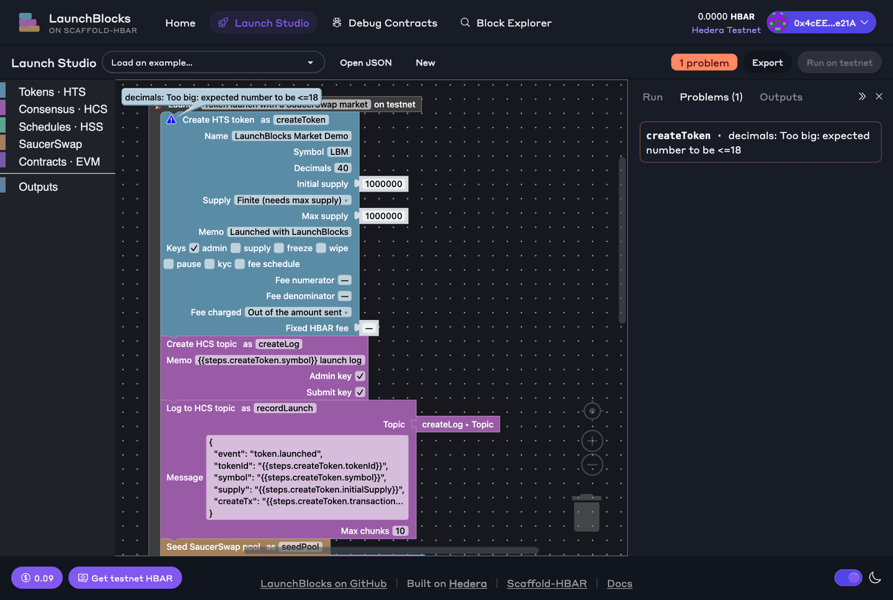<br>
      <b>Mistakes show up before anything is spent.</b> Every field and every wire is checked against the step schemas as you edit. Here Decimals 40 is flagged on the block and in Problems, and Run stays disabled.
    </td>
    <td width="50%" valign="top">
      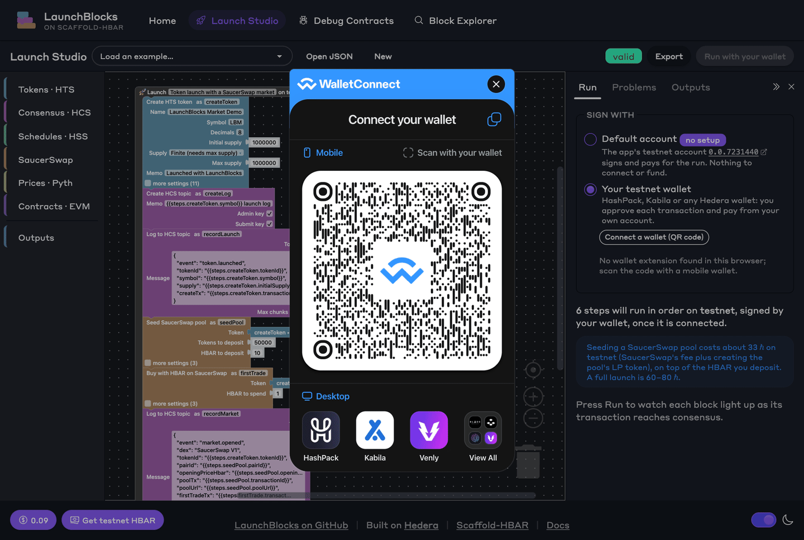<br>
      <b>The app's account, or your own wallet.</b> Runs are signed by the default account unless you connect HashPack, Kabila or another WalletConnect wallet, which then approves each transaction.
    </td>
  </tr>
  <tr>
    <td width="50%" valign="top">
      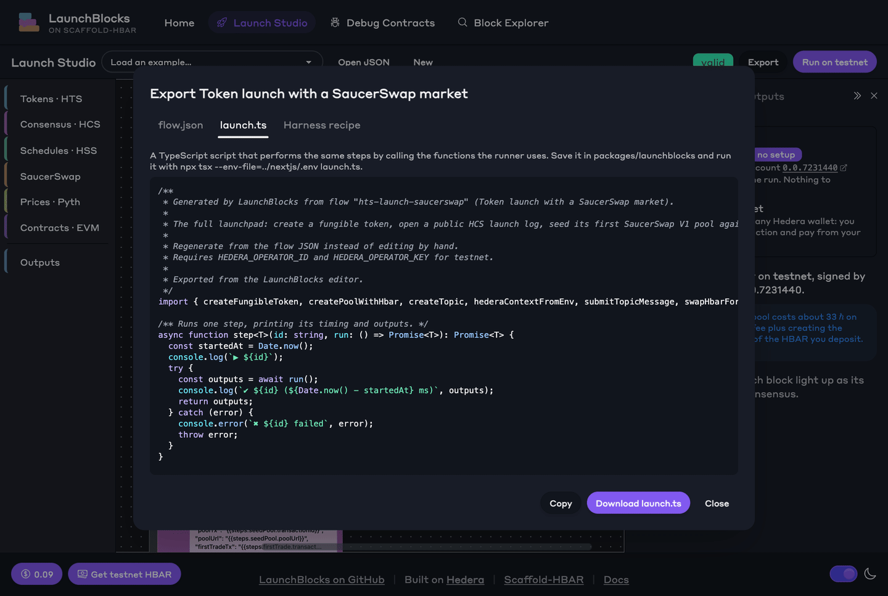<br>
      <b>Export it as code.</b> A <code>launch.ts</code> that calls the same functions the runner uses, next to the flow JSON that <code>core:run</code> takes.
    </td>
    <td width="50%" valign="top">
      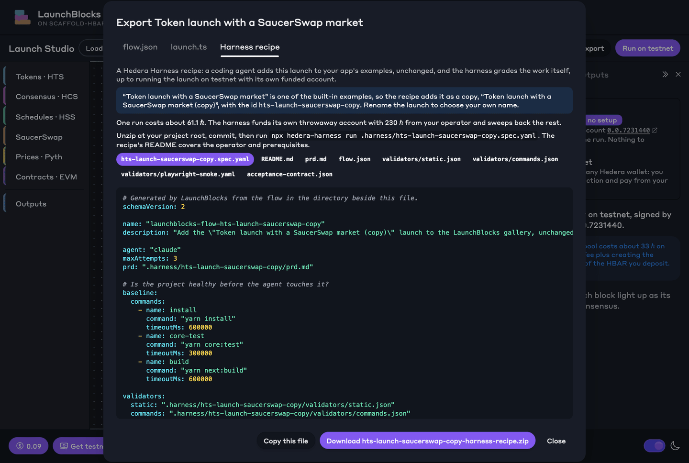<br>
      <b>Or as an agent recipe.</b> A Hedera Harness recipe with a cost estimate: a coding agent adds the launch to your app, and the harness grades the result on testnet.
    </td>
  </tr>
</table>

### Or from the terminal


*`core:doctor` checks the operator account without spending anything. `core:run` then launches `hts-launch-scheduled-unlocks` on testnet: a token, its launch log, and two supply unlocks that the Schedule Service will run on their dates.*

## Verified on testnet

A single run of the gallery flow `hts-launch-saucerswap`, started from the Launch Studio. Every id below can be checked independently: the launch log on HCS records all of them.

| What | Where |
| --- | --- |
| Token `LBM` (1,000,000 supply, 8 decimals) | [0.0.10674237](https://hashscan.io/testnet/token/0.0.10674237) |
| HCS launch log | [0.0.10674240](https://hashscan.io/testnet/topic/0.0.10674240) — `token.launched`, `market.opened` |
| SaucerSwap V1 pool (10 ℏ + 50,000 LBM, opening price exactly 0.0002 ℏ) | [0.0.10674241](https://hashscan.io/testnet/contract/0.0.10674241) |
| Pool deposit | [0.0.7231440-1790127888-310486314](https://hashscan.io/testnet/transaction/0.0.7231440-1790127888-310486314) |
| First trade: 1 ℏ → 4,533.0544694 LBM, filled exactly at the quote | [0.0.7231440-1790127891-895373365](https://hashscan.io/testnet/transaction/0.0.7231440-1790127891-895373365) |

The other gallery flows, also run from the Launch Studio:

| What | Where |
| --- | --- |
| `hts-launch-locked-liquidity`: a `TokenLock` holding all 707.10677118 LP tokens of the new pool until 2026-10-23 | [lock 0.0.10676443](https://hashscan.io/testnet/contract/0.0.10676443), [LP token 0.0.10676441](https://hashscan.io/testnet/token/0.0.10676441), [log 0.0.10676438](https://hashscan.io/testnet/topic/0.0.10676438) |
| `hts-launch-usd-price`: a pool opened at $0.00002 a token, pairing 50,000 tokens with 12.41463079 ℏ at Pyth's HBAR/USD of $0.08055012, read from Pyth's contract without a key | [pool 0.0.10700800](https://hashscan.io/testnet/contract/0.0.10700800), [token 0.0.10700795](https://hashscan.io/testnet/token/0.0.10700795), [log 0.0.10700797](https://hashscan.io/testnet/topic/0.0.10700797) |
| `hts-launch-scheduled-unlocks`: two 250,000-token unlocks, scheduled for 2026-10-23 and 2026-11-22 | [schedule 0.0.10676533](https://hashscan.io/testnet/schedule/0.0.10676533), [schedule 0.0.10676534](https://hashscan.io/testnet/schedule/0.0.10676534), [token 0.0.10676531](https://hashscan.io/testnet/token/0.0.10676531) |
| A scheduled mint and a scheduled transfer set 60 s out, which the network ran by itself | [schedule 0.0.10676486](https://hashscan.io/testnet/schedule/0.0.10676486), [schedule 0.0.10676488](https://hashscan.io/testnet/schedule/0.0.10676488) |
| `hts-launch-basic` signed in **HashPack** by a visitor's own testnet account: five approvals, 26.42 ℏ paid by the wallet, which is the token's treasury | [token 0.0.10716072](https://hashscan.io/testnet/token/0.0.10716072), [log 0.0.10716076](https://hashscan.io/testnet/topic/0.0.10716076), [account 0.0.8194954](https://hashscan.io/testnet/account/0.0.8194954) |

What those runs left on-chain, as other apps show it:

<table>
  <tr>
    <td width="50%" valign="top">
      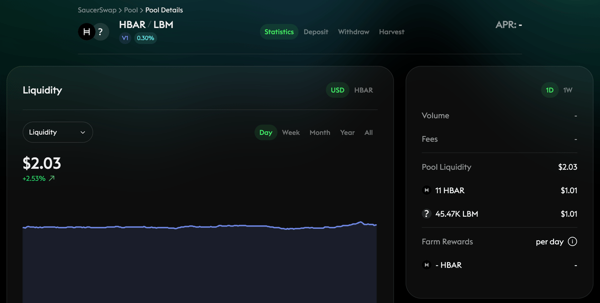<br>
      <b>The pool on SaucerSwap.</b> The HBAR/LBM V1 pool from the first table, in SaucerSwap's own app after the first trade: the 10 ℏ and 50,000 LBM deposited, plus the 1 ℏ trade.
    </td>
    <td width="50%" valign="top">
      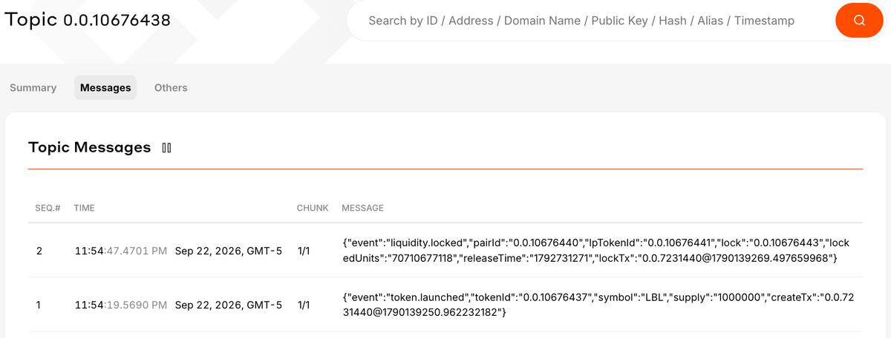<br>
      <b>The launch log on HCS.</b> Each launch writes what it created to its own topic as it goes; here the token, then the pool, LP token and lock.
    </td>
  </tr>
  <tr>
    <td width="50%" valign="top">
      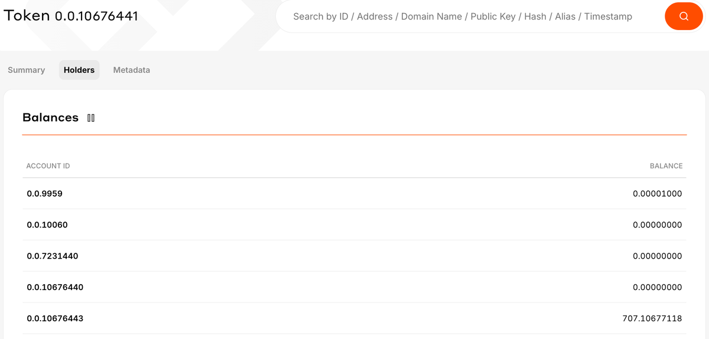<br>
      <b>Liquidity that cannot be pulled.</b> The <code>TokenLock</code> contract 0.0.10676443 holds all 707.10677118 LP tokens, and the treasury holds none.
    </td>
    <td width="50%" valign="top">
      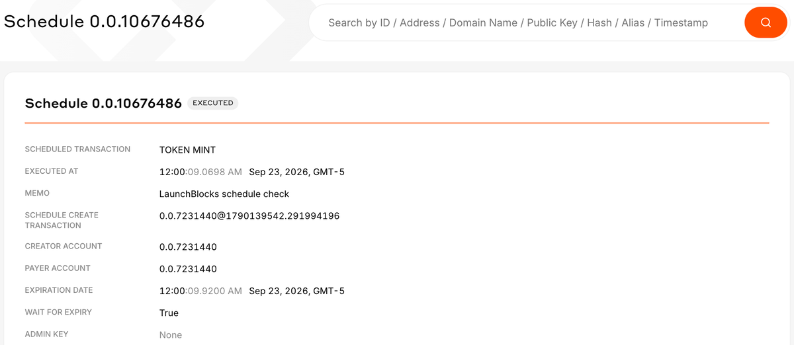<br>
      <b>A schedule the network ran by itself.</b> A mint created with <code>waitForExpiry</code>, executed at its expiration time with nobody online.
    </td>
  </tr>
</table>

## Launch pages and share links

Every gallery flow opens an HCS topic and writes a JSON event to it at each milestone: `token.launched`, `market.opened`, `liquidity.locked`, `unlocks.scheduled`. That log names everything the launch created, in consensus order, and nobody can change it afterwards. So a launch page needs nothing but the topic id: `/launches/0.0.10676438` reads the log from the mirror node, then shows each entity as it is now. That means the token's supply, the pool's price (from its reserves) against the price it opened at, what the `TokenLock` still holds and when it unlocks, and whether each schedule has executed. Nothing is stored by the app, so a launch run from the terminal, another deployment or `launch.ts` gets the same page.


A launch log gets a submit key by default, so only the account that ran the launch can write to it. On a topic without one, anyone can post, so the page builds its cards only from the messages paid for by the account that wrote the first one, and marks the others.

`/launches` opens one by topic id and lists [real launches on testnet](https://launchblocks.aivylabs.xyz/launches). The reader is `readLaunch` in `packages/launchblocks/src/launches/`, so the same record is available from code and from the [MCP server](#use-it-from-an-ai-agent-mcp).

**Share** in the studio's toolbar copies a link such as `https://…/launch#flow=rVXBbts4EP0V…`: the flow, compressed (the locked-liquidity example fits in 1,230 characters), in the URL's fragment. Browsers never send the fragment to a server, so a shared launch is stored nowhere but in the link, and whoever opens it gets the same blocks to edit, validate and run with their own account or wallet.

## Environment variables

All live in `packages/nextjs/.env` and are read on the server only. None of them is prefixed `NEXT_PUBLIC_`, so none can reach the browser.

| Variable | Required | Default | What it is |
| --- | --- | --- | --- |
| `HEDERA_OPERATOR_ID` | yes | — | The account that pays for and signs every step, e.g. `0.0.1234567`. It becomes the token treasury and holds every key it enables. |
| `HEDERA_OPERATOR_KEY` | yes | — | That account's private key. DER (as issued by the Portal) or raw hex. |
| `HEDERA_OPERATOR_KEY_TYPE` | for raw hex keys | — | `ecdsa` or `ed25519`. Raw hex does not say which curve it is; DER does. |
| `HEDERA_NETWORK` | no | `testnet` | `testnet`, `mainnet` or `localnet`. SaucerSwap steps need testnet or mainnet. |
| `HEDERA_MIRROR_URL` | no | per network | Override the mirror node base URL. |
| `PYTH_API_KEY` | no | — | A Hermes API key from [Pyth Terminal](https://docs.pyth.network/price-feeds/core/upgrade/preparing). With it, **Price in USD with Pyth** posts a fresh HBAR/USD update before reading it; without it, the step reads the price already on Hedera. |
| `PYTH_HERMES_URL` | no | Pyth's own | Another Hermes provider, `https://` only: the key travels in a header. |
| `LAUNCHBLOCKS_ALLOW_MAINNET` | no | `false` | The run API refuses mainnet flows unless this is exactly `true`. |
| `LAUNCHBLOCKS_RUN_TOKEN` | no | — | If set, runs through the API need an `x-launchblocks-token` header; the studio asks for it. |
| `LAUNCHBLOCKS_RUNS_PER_HOUR` | no | `20` | Per-client run limit for a public deployment; `0` turns it off. |
| `LAUNCHBLOCKS_PUBLIC_DEMO` | no | `false` | `true` applies the [public-run policy](#deploying-the-studio) for a deployment whose operator pays for anonymous visitors. |
| `LAUNCHBLOCKS_PUBLIC_HBAR_PER_HOUR` | no | `400` | With the policy on: the most HBAR all visitors' runs may cost in an hour, counted at each run's worst case. |
| `LAUNCHBLOCKS_PUBLIC_MAX_HBAR_PER_STEP` | no | `25` | With the policy on: the most HBAR one step may deposit or trade. |
| `LAUNCHBLOCKS_STUDIO_URL` | no | `http://localhost:3000` | For the [MCP server](#use-it-from-an-ai-agent-mcp) only: where its share links and launch pages point. |
| `LAUNCHBLOCKS_ARTIFACTS_DIR` | no | `packages/hardhat/artifacts/contracts` | Where **Deploy contract** finds compiled contracts, for a script run from outside the project. |

The public variables are Scaffold-HBAR's: `NEXT_PUBLIC_WALLET_CONNECT_PROJECT_ID`, used by RainbowKit and by the studio's wallet option, and `NEXT_PUBLIC_HEDERA_TESTNET_RPC_URL` and `NEXT_PUBLIC_HEDERA_MAINNET_RPC_URL`, the JSON-RPC relays for EVM wallets and Debug Contracts. The WalletConnect id falls back to a shared development id; set your own from [WalletConnect Cloud](https://cloud.reown.com) before you deploy.

`packages/hardhat/.env` is separate: it holds only the Hardhat deployer key (`yarn hardhat:account:generate`), and flows never read it.

## How it works

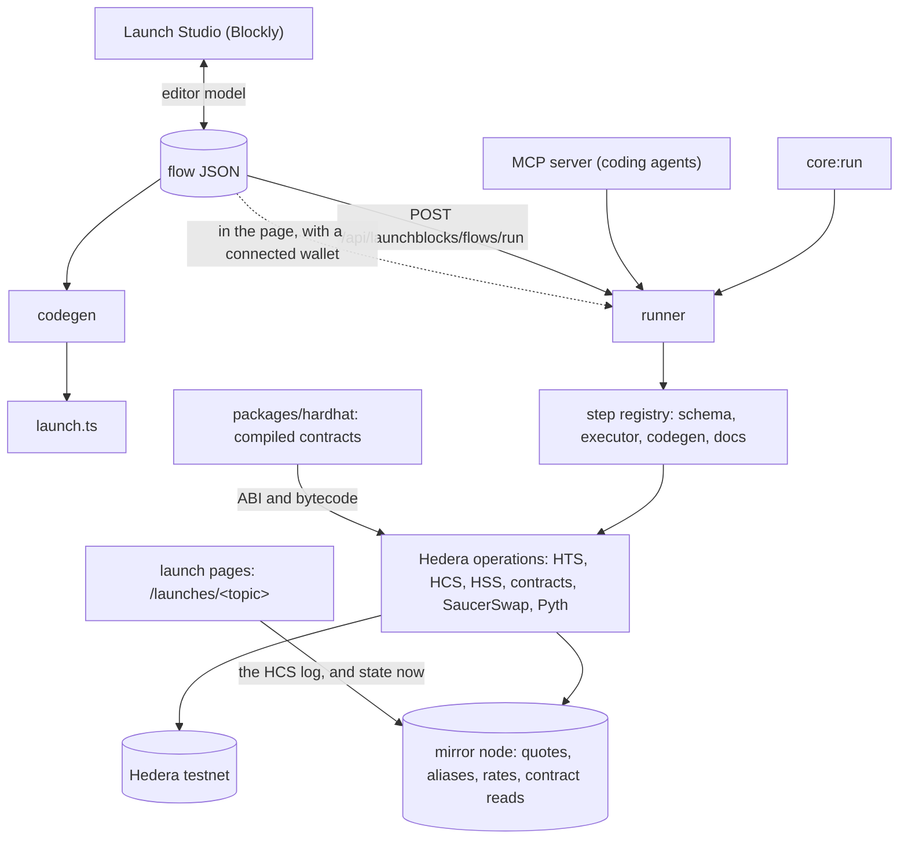

A **flow** is an ordered list of steps. Each step has a `type`, a camelCase `id`, and `params`. A param can use an earlier step's output with `{{steps.<id>.<key>}}`: a param that is exactly one reference keeps the output's type, and a reference inside longer text is interpolated.

```json
{
  "schemaVersion": 1,
  "id": "hts-launch-saucerswap",
  "name": "Token launch with a SaucerSwap market",
  "network": "testnet",
  "steps": [
    { "id": "createToken", "type": "hts.createToken", "params": { "name": "LaunchBlocks Market Demo", "symbol": "LBM" } },
    { "id": "seedPool", "type": "saucerswap.createPool",
      "params": { "tokenId": "{{steps.createToken.tokenId}}", "tokenAmount": "50000", "hbarAmount": "10" } }
  ]
}
```

Before anything runs, the flow is checked from end to end. That covers the document's shape, every step's params against its schema, and the **wiring**: each reference must point at an earlier step, name an output that step actually produces, and give a value the receiving param accepts. That last check runs each step's example output through the next step's schema, so feeding a number into a token id is caught before any HBAR is spent.

**Who signs.** A run from the studio goes one of two ways, chosen in the Run panel's **Sign with** section:

- **Default account** (the default). The API route runs the flow with `HEDERA_OPERATOR_ID` and `HEDERA_OPERATOR_KEY` and streams events back. The panel names the account; the key never leaves the server.
- **Your testnet wallet.** The studio connects the wallet with hedera-wallet-connect, loading the connector only when this option is picked. The same runner then runs in the page through `@sh/launchblocks/browser`, with a context built by `walletHederaContext`. Each transaction is frozen for the wallet account and sent to the wallet with `hedera_signAndExecuteTransaction`: one approval per transaction, and the Run panel says roughly how many a flow needs. Nothing else goes through the wallet. Receipts come from free queries, while token details, contract results and pending airdrops come from the mirror node, so the wallet is never asked to approve a paid query. The wallet account's public key, which new tokens use for their keys, is also read from the mirror node, because wallets do not expose it. Accounts with a key list or a threshold key are refused, since one wallet cannot sign for them. So are topic messages longer than one 1024-byte chunk, because each chunk would need its own approval.

The terminal can exercise the same path: `yarn core:run -- <flow> --wallet` runs with a wallet context whose signer is the SDK's `Wallet` holding the operator key, so every transaction goes through `executeWithSigner` exactly as it would with a browser wallet.

**Packages**

| Package | What it holds |
| --- | --- |
| `packages/launchblocks` | The core, with no framework: flow schema, step registry, runner, codegen, Hedera and SaucerSwap operations, the terminal scripts, and about 480 unit tests. It has two browser entries: `@sh/launchblocks/editor` for the block editor, which a test keeps free of zod and the Hedera SDK, and `@sh/launchblocks/browser` for wallet runs, which a test keeps free of Node built-ins. |
| `packages/nextjs` | The Launch Studio (`app/launch`), API routes (`app/api/launchblocks`), and the Scaffold-HBAR app shell. |
| `packages/hardhat` | The starter's contracts, tests and deploy scripts. |

**API routes** (all under `/api/launchblocks`): `GET steps` (catalog with a JSON Schema for each step), `GET gallery`, `POST flows/validate`, `POST flows/codegen`, `POST flows/harness`, `POST flows/run` (the full result, or NDJSON events with `Accept: application/x-ndjson`), `GET operator` (the default account's id, never its key), `GET artifacts/<Contract>` (a compiled contract's ABI and bytecode, for wallet runs that deploy one), and `GET pyth/updates` (signed Pyth price updates for wallet runs, fetched with the server's key, for the feeds the steps use only).

## Steps

Generated from the step definitions with `yarn core:docs`; CI fails if this table falls out of date.

<!-- launchblocks:steps:start -->
| Step | What it does | Services | Params | Outputs other steps can use |
| --- | --- | --- | --- | --- |
| `hts.createToken` | Create a fungible HTS token with configurable keys, supply type and custom fees. | HTS | `name`, `symbol`, `decimals`, `initialSupply`, `supplyType`, `maxSupply`, `memo`, `keys: { admin, supply, freeze, wipe, pause, kyc, feeSchedule }`, `fractionalFee: { numerator, denominator, assessment }`, `fixedHbarFee: { amountHbar }` | `tokenId`, `treasuryAccountId`, `transactionId`, `symbol`, `decimals`, `initialSupply` |
| `hts.mint` | Mint additional supply into the treasury (requires the supply key). | HTS | `tokenId`, `amount` | `tokenId`, `transactionId`, `newTotalSupply` |
| `hts.transfer` | Transfer tokens from the treasury to an associated account. | HTS | `tokenId`, `to`, `amount`, `memo` | `to`, `transactionId` |
| `hts.airdrop` | Airdrop tokens to early supporters without requiring association (HIP-904). | HTS | `tokenId`, `recipients`, `memo` | `transactionId`, `recipientCount`, `pendingCount` |
| `hts.associate` | Associate the operator with an existing token; a no-op if already associated. | HTS | `tokenId` | `accountId`, `transactionId` |
| `hcs.createTopic` | Create an HCS topic as the launch's public, ordered, timestamped log. | HCS | `memo`, `adminKey`, `submitKey` | `topicId`, `transactionId` |
| `hcs.submitMessage` | Append a text or JSON message to a topic, with consensus timestamp and sequence number. | HCS | `topicId`, `message`, `maxChunks` | `topicId`, `sequenceNumber`, `transactionId` |
| `hss.scheduleTransfer` | Schedule a token transfer from the treasury that the network runs later by itself, for vesting. | HSS, HTS | `tokenId`, `to`, `amount`, `delaySeconds`, `memo`, `adminKey` | `scheduleId`, `executesAt`, `scheduledTransactionId` |
| `hss.scheduleMint` | Schedule a mint into the treasury that the network runs later by itself, for a supply unlock. | HSS, HTS | `tokenId`, `amount`, `delaySeconds`, `memo`, `adminKey` | `scheduleId`, `executesAt`, `scheduledTransactionId` |
| `pyth.priceInUsd` | Price a pool in US dollars: the HBAR to pair with a token deposit, from Pyth's HBAR/USD feed. | SmartContract, MirrorNode, Pyth | `tokenAmount`, `tokenPriceUsd`, `maxAgeSeconds`, `maxConfidenceBps` | `tokenAmount`, `hbarAmount`, `hbarUsd`, `pythContractId`, `updateTransactionId` |
| `saucerswap.createPool` | Create the token's first SaucerSwap V1 liquidity pool against HBAR, making it tradeable. | HTS, SmartContract, MirrorNode, SaucerSwap | `tokenId`, `tokenAmount`, `hbarAmount`, `slippageBps`, `deadlineSeconds`, `gasLimit`; JSON only: `feeBufferBps`, `createPairGasLimit` | `pairId`, `lpTokenId`, `liquidity`, `createPairTransactionId`, `transactionId`, `openingPriceHbar`, `creationFeeHbar` |
| `saucerswap.swap` | Buy the token with HBAR through its SaucerSwap V1 pool, proving the market is live. | HTS, SmartContract, MirrorNode, SaucerSwap | `tokenId`, `hbarAmount`, `slippageBps`, `deadlineSeconds`, `gasLimit` | `transactionId`, `tokensOut`, `effectivePriceHbar` |
| `contract.deploy` | Deploy a Hardhat-compiled contract to Hedera, with constructor arguments and token slots. | SmartContract, MirrorNode | `contract`, `arg1`, `arg2`, `arg3`, `arg4`, `autoAssociations`, `gas`, `initialHbar`, `adminKey`; JSON only: `memo` | `contractId`, `accountId`, `transactionId` |
| `contract.call` | Call a contract function: views and pure functions for free through the mirror node, others as a transaction. | SmartContract, MirrorNode | `contractId`, `function`, `arg1`, `arg2`, `arg3`, `arg4`, `payableHbar`, `gas` | `result`, `transactionId` |
<!-- launchblocks:steps:end -->

In the studio, the Outputs drawer lists what each step produces. Drag an output onto any socket that accepts it: ids and amounts take outputs of their kind, and contract arguments take any output.


## The SaucerSwap integration

Creating a pool and trading against it takes about twenty lines of SDK calls. Getting them right took measurements on testnet. Each point below is handled for you by `saucerswap.createPool` and `saucerswap.swap`, and each one came from a real failed run.

1. **LP tokens and swap outputs must go to the account's EVM alias.** Most code passes `AccountId.toSolidityAddress()`, the long-zero form (`0x…6e57d0`). For an account created from an ECDSA alias, the contracts accept it all the way until the final transfer: the pair is deployed, it is funded, the LP tokens are minted, and then the payout fails with `INVALID_ALIAS_KEY`. The revert only says `Safe token transfer failed!`. The real status shows up only in the transaction's child records (`/api/v1/transactions/<id>`). Both steps look up the alias with the mirror node first.

2. **The opening price is exact because the pool is created in two calls.** The router's one-call `addLiquidityETHNewPool` deposits everything in `msg.value` beyond the creation fee it works out at consensus. That fee is priced in *tinycents* and converted at the exchange rate in effect at that moment, which the caller can only estimate. On testnet, the mirror node's `current_rate` had expired and consensus used its `next_rate`, so one run deposited 10.32 ℏ instead of 10 and opened 3.2% high. The step instead calls `factory.createPair` with the fee quoted at the higher of the two listed rates plus a 2% buffer. The factory sends any excess to SaucerSwap's rent payer, never to the pool, and a short fee reverts before anything is deposited. Then `router.addLiquidityETH` deposits exactly the amounts you asked for.

3. **The documented gas is too low.** SaucerSwap documents 3,200,000 for pool creation. Measured on testnet: `createPair` 5,849,994, the one-call path 6,788,255, and the deposit 974,522. With too little gas, the contracts' guard messages (`Safe multiple associations failed!`, then `Safe single association failed!`) appear after about 98% of the limit is spent. The defaults are set from these measurements.

4. **The mirror node trails consensus.** A pool read, or a swap quote simulated on the mirror node straight after the deposit, still sees the old state. Reads that follow a write retry until the mirror catches up. Every quote comes from the router's own `getAmountsOut` through the mirror node's free `eth_call`, so quoting never costs HBAR and uses exactly the maths the swap will.

The integration also refuses to create a pool that already exists, grants the router an allowance through the token's ERC-20 facade (the approval SaucerSwap's own front end asks users to sign), and resolves pair contract ids through the mirror node, because pairs are deployed with CREATE2 and their addresses cannot be derived from the id arithmetically.

## Locking liquidity and scheduling unlocks

Two things holders of a new token ask: can the team pull the liquidity, and when does more supply arrive?

**`TokenLock`** (`packages/hardhat/contracts/TokenLock.sol`) holds one token until a release time, then pays everything it holds to a fixed beneficiary. It has no owner and nothing changes after deployment, so no one can move the tokens early, including whoever deployed it. Anyone can trigger a release that is due, and the tokens only go to the beneficiary. In `hts-launch-locked-liquidity`, **Deploy contract** creates it with the pool's LP token, the treasury as beneficiary and 30 days, plus one token association slot so it can receive the LP token. **Transfer tokens** moves `seedPool ▸ LP tokens received` into it, and **Call contract** reads `lockedAmount()` and `releaseTime()` back for free before they go on the HCS log. The pool step reads the LP token from the pair's `lpToken()`: on SaucerSwap V1 it is a separate HTS token, not the pair contract. Deploying the lock costs about 16 ℏ, most of it the ContractCreate fee.


**Scheduled unlocks** use the Schedule Service. **Schedule a mint** and **Schedule token transfer** create a long-term schedule that the network runs on its date; `delaySeconds` can be at most 62 days, the network's limit. Past that, schedule each tranche within 62 days of a run, or lock the tokens in a contract.

## Pricing a launch in US dollars with Pyth

A pool's opening price is the ratio of what goes into it. **Price in USD with Pyth** lets you set it in dollars instead: give it the tokens you will deposit and the price of one token in US dollars, and it reads HBAR/USD from [Pyth](https://pyth.network) and outputs **Tokens** and **HBAR** to wire into **Seed SaucerSwap pool**. HBAR = tokens × price ÷ HBAR/USD, in exact decimal arithmetic, rounded down to a tinybar.

Pyth is a pull oracle. Its contract on Hedera (`0.0.3042133` on testnet, `0.0.4622850` on mainnet) holds the last price anyone posted, and anyone can post a fresher one with a signed update from Hermes, Pyth's price service. The step does both:

- **With `PYTH_API_KEY`**, it fetches a signed HBAR/USD update from Hermes, asks the contract for its fee (1 tinybar per update on testnet), rehearses `updatePriceFeeds` for free through the mirror node, then sends it, waits for the mirror node, and reads the price back. In a wallet run the wallet pays, and the key stays on the server behind `GET /api/launchblocks/pyth/updates`.
- **Without a key**, it reads the price already on-chain through the mirror node, for free.

It refuses a price older than `maxAgeSeconds` (120 by default; 0 accepts any age) and one whose confidence interval is wider than `maxConfidenceBps` of it (1% by default), before anything is spent.

**What works on Hedera today (checked 2026-09-24).** Only the on-chain read. Since its 26 August upgrade, Hermes answers only requests with an API key, and the updates it issues are refused by Pyth's contracts on Hedera, testnet and mainnet alike, with `InvalidWormholeVaa()`: [a real update on testnet](https://hashscan.io/testnet/transaction/0.0.7231440-1790279760-915729876) reverted that way, and a mirror-node rehearsal on mainnet did the same. Nobody has posted HBAR/USD to testnet since 23 August. So the step rehearses first and stops with `PYTH_UPDATE_REJECTED`, having sent nothing, and `hts-launch-usd-price` sets Max age to 0: it opens the pool from the last on-chain price and writes that price's publish time to the launch log. The run in [Verified on testnet](#verified-on-testnet) did exactly that: its log says `"priceSource": "Pyth on-chain"`, and 0.00024829 ℏ a token at $0.08055012 is exactly $0.00002. When Pyth upgrades its Hedera contracts, setting `PYTH_API_KEY` (with a plan that covers HBAR/USD) turns on fresh prices with no code change.

## Hedera services used

- **Token Service (HTS):** fungible tokens with configurable admin, supply, freeze, wipe, pause, KYC and fee-schedule keys; finite or infinite supply; fractional and fixed-HBAR custom fees; minting; transfers; HIP-904 airdrops, which also reach accounts that have not associated the token; association; allowances.
- **Consensus Service (HCS):** a topic per launch as a public, ordered, timestamped log, with messages in text or JSON and chunking up to 20 KB.
- **Schedule Service (HSS):** long-term scheduled transactions (HIP-423). A ScheduleCreate with an expiration time and `waitForExpiry` runs a transfer or a mint on its date with nobody online; the operator's signature on the create completes it, and an optional admin key makes it cancellable.
- **Smart contracts:** your own contracts from `packages/hardhat`, deployed with `ContractCreateFlow` (the bytecode goes to the File Service, then ContractCreate) with token association slots, or with a wallet as a single ContractCreate with the bytecode inline, so a small contract costs one approval; and called with `ContractExecuteTransaction`; SaucerSwap V1's factory, router and pairs; each token's ERC-20 facade.
- **Mirror node:** free read-only contract calls for quotes, pool and LP token lookups, and the **Call contract** block's views (after waiting for the mirror node to catch up with earlier writes), account and key verification, EVM alias resolution, exchange rates, and reading the launch log back. With a wallet it also stands in for paid queries: token details, contract results and gas used, and which airdrop recipients were left pending.
- **Pyth:** HBAR/USD from Pyth's contract on Hedera, read through the mirror node, or refreshed first with `updatePriceFeeds` and a signed update from Hermes.
- **Wallets (HIP-820):** hedera-wallet-connect's `DAppConnector` and `DAppSigner` connect a visitor's account over WalletConnect, and `hedera_signAndExecuteTransaction` has the wallet sign and submit each transaction.

## Scripts

| Command | What it does |
| --- | --- |
| `yarn core:doctor` | Check the operator (key, account, network, balance) without spending anything. |
| `yarn core:check <flow.json \| gallery-id>` | Validate a flow, make the checks a run makes before its first step, and list its steps with their cost; nothing is sent. |
| `yarn core:run <flow.json \| gallery-id>` | Run a flow. `--dry-run` is `core:check`; `--codegen out.ts` also writes the script; `--env <path>` and `--network <net>` pick the operator's env file and network; `--wallet` signs through a `Signer` as a browser wallet would; `--help` lists them. File paths are relative to where you typed the command (npm) or to the project root. Each run's full result is saved under `packages/launchblocks/runs/`. |
| `yarn next:dev` | Start the app with the Launch Studio at `/launch`. |
| `yarn core:test` · `yarn next:test` | Unit tests (vitest) for the core, and for the API routes: run guards, the public-demo policy, error statuses, streaming. No network. |
| `yarn next:e2e` | Drive the Launch Studio in Chromium (Playwright) against the production build: every example loads valid, a bad field is flagged, export works, a run without an operator explains why. Run `yarn next:build` and, once, `yarn next:e2e:install` first. The test server gets no operator, so nothing is spent. |
| `yarn core:docs` · `yarn core:docs:check` | Regenerate the step table in this README, or only check that it is current. |
| `yarn core:mcp` | Start the [MCP server](#use-it-from-an-ai-agent-mcp) on stdio. MCP clients should run `node packages/launchblocks/bin/mcp.cjs` instead, with no package manager in between. |
| `yarn core:harness <flow.json>` | Export a flow as a [Hedera Harness recipe](#export-any-launch-as-a-recipe) into `.harness/`, the same files as the studio's **Export → Harness recipe**. |
| `yarn harness:doctor` · `yarn harness:validate` · `yarn harness:run` | The [Hedera Harness recipe](#extending-it-with-hedera-harness). |
| `yarn lint` · `yarn check-types` · `yarn test` | Everything, across packages. |

Gallery flows live in `packages/launchblocks/flows/`: `hts-launch-saucerswap` (the full launch), `hts-launch-locked-liquidity` (the launch with its LP tokens locked in a `TokenLock` for 30 days; about 77 ℏ), `hts-launch-usd-price` (the pool opened at a dollar price from Pyth; about 62 ℏ), `hts-launch-scheduled-unlocks` (a reserve that unlocks in two scheduled tranches; about 14 ℏ) and `hts-launch-basic` (token with a 1% fee, HCS log and reserve mint; no pool, about 27 ℏ).

With npm, put `--` before flags meant for the script, or they never reach it: `npm run core:run -- <flow> --codegen out.ts`. `core:run` and `core:check` skip a stray `--`, so that form works with either package manager.

An exported `launch.ts` calls this package's operations, so it runs inside the repo: save it in `packages/launchblocks/` and run `npx tsx --env-file=../nextjs/.env launch.ts`.

**Checks on every push.** CI lints (a warning fails it), type-checks, runs the core tests with coverage and the API tests, checks the step table above, compiles the contracts and tests them on a Hedera fork, builds the app and drives the studio in Chromium, and scans the whole git history for committed secrets with gitleaks. **Fresh scaffold** then creates a project from the published template with the latest Scaffold-HBAR CLI, once with each package manager the template supports, and checks it item by item as the bounty gate does: files, install, lint, types, tests, a dry run of every gallery flow, the build, the served app's routes, and the studio in a browser. Its script runs locally too: `.github/scripts/check-scaffold.sh <project> <package-manager>`.

## Adding a step type

Each step is one file under `packages/launchblocks/src/steps/<namespace>/`. The file holds the step's zod input and output schemas, an example output, editor fields, docs, the executor, and codegen. Register it in `src/steps/index.ts` and it appears in the registry, the API and the Launch Studio toolbox with no frontend changes; `yarn core:docs` adds it to this README's step table. A contract test checks every shipped step: its example output must be valid, its editor fields must exist in its schema, it must have docs, and its generated code must parse. [AGENTS.md](AGENTS.md) walks a coding agent through it.

## Extending it with Hedera Harness

`.harness/` is a [hedera-harness](https://github.com/hedera-dev/hedera-harness) recipe. It asks a coding agent to add a **Burn tokens** step (`hts.burn`) by following [AGENTS.md](AGENTS.md), then checks the result itself:

| Tier | Check |
| --- | --- |
| 0–1 | The step, operation, tests and gallery flow exist where AGENTS.md puts them; tests, lint, strict types, the README docs check, a dry run of the new flow, and the production build all pass. |
| 2 | The app boots; `/`, `/launch` and the step and gallery APIs render. |
| 3 | In the running studio, **Burn tokens** is in the toolbox, the new example loads as valid, and export generates the call. |
| 3.5 | The new flow burns supply **on testnet**, run as the harness's funded throwaway account. That account is passed to the flow runner only through environment variables. |

The validators were checked in both directions. On the template as shipped they fail with 15 findings, all about the missing step. On a correct implementation they pass with none.

**A full run passed.** A full recipe run on a fresh clone had Claude Code build the step from `prd.md` in about five minutes, touching nothing under `packages/nextjs`. The harness then graded every tier: tests, lint, types and the build; the booted app; all five acceptance assertions in the running studio; and, on testnet, its own funded account created token [`0.0.10700526`](https://hashscan.io/testnet/token/0.0.10700526) and burned 100,000 of its 1,000,000 tokens. The agent's work is published unchanged on the [`harness/run-launchblocks-hts-burn-06e832`](https://github.com/jmgomezl/scaffold-hbar-launchblocks/tree/harness/run-launchblocks-hts-burn-06e832) branch ([its diff](https://github.com/jmgomezl/scaffold-hbar-launchblocks/commit/2dd34dd08f44f34e990230ac1153b5403d31a624)). Details, and how to run it, are in [.harness/README.md](.harness/README.md).

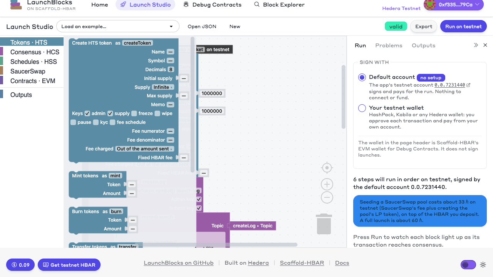

*The **Burn tokens** block the agent added, in the studio's toolbox, as the harness's validator saw it. No frontend code changed: the studio found the step in the registry.*

Before a run: the harness refuses env files in the workspace, so move `packages/nextjs/.env` aside and export `HEDERA_OPERATOR_ID` and an ECDSA `HEDERA_OPERATOR_KEY` in your shell instead; and install Playwright's browser with `npx playwright install chromium`. The recipe's commands are fixed to the template's default package manager (see [.harness/README.md](.harness/README.md)), so it does not run in a project scaffolded with npm. `harness:doctor` checks all of it.

```bash
yarn harness:doctor     # prerequisites and the recipe
yarn harness:validate   # Tiers 0–2, no agent
yarn harness:run        # the full agent run
```

### Export any launch as a recipe

A launch you build can become a recipe of its own. In the Launch Studio, **Export → Harness recipe** downloads it as a zip to unpack at the project root; `yarn core:harness <flow.json>` writes the same files from the terminal. The recipe asks a coding agent to add the launch to the gallery unchanged, then grades the work:

| Tier | Check |
| --- | --- |
| 0 | The copy in `packages/launchblocks/flows/` and its gallery entry exist, with the exported ids and step types. No env files. |
| 1 | Core tests (which validate every gallery flow and round-trip it through the editor), lint and types; the copy is exactly the export; a dry run by gallery id; the production build. |
| 2 | The app boots, and `/launch?example=<id>` renders. |
| 3 | The studio lists the example and loads it as valid, the gallery API lists it, and its export has one section per step. |
| 3.5 | For testnet flows, the launch runs **on testnet** by its gallery id, as the harness's funded throwaway account. |

The spec funds that account from a cost estimate: measured fees per step type, plus the HBAR the flow hands over to pools and swaps, times three attempts with 25% headroom. The harness sweeps back what is left. The files go to `.harness/<flow-id>.spec.yaml` and `.harness/<flow-id>/`, beside the template's own recipe, because the harness takes a spec's parent directory as the project root. A flow that is already a gallery example is refused; rename the launch first.

This was checked with the real harness on the basic flow under a new name, `treasury-launch`. `validate` failed with 6 findings before the flow was in the gallery, all about the missing copy and its registration, and passed with none after, Playwright gate included. The Tier 3.5 command ran the flow on testnet as signer: token [`0.0.10676025`](https://hashscan.io/testnet/token/0.0.10676025), 26.42 ℏ in fees against an estimate of 26.7 ℏ.

```bash
yarn core:harness my-launch.json                            # or Export → Harness recipe in the studio
npx hedera-harness validate .harness/my-launch.spec.yaml    # Tiers 0–2, no agent
npx hedera-harness run .harness/my-launch.spec.yaml         # the agent, then every tier
```

## Use it from an AI agent (MCP)

LaunchBlocks is also an [MCP](https://modelcontextprotocol.io) server, so a coding agent can compose launches the way the studio does. Ask for "a token called Rocket with a 1% fee and a SaucerSwap pool at 0.0002 ℏ, locked for 30 days". It reads the catalog, writes the flow, validates it until every schema and reference checks out, tells you what it will cost, and hands you a studio link to review the blocks. Or it runs the flow, if you ask it to.

| Tool | What it does |
| --- | --- |
| `list_steps` · `get_step` | The step catalog; one step's params as JSON Schema, with an example of its outputs |
| `list_examples` · `get_example` | The gallery flows, to start from |
| `validate_flow` | Every issue, or `ok` with the estimated HBAR cost, step by step |
| `generate_script` | The flow as `launch.ts` |
| `share_link` | A studio link that opens the flow as blocks |
| `run_flow` | A dry run by default (validation, cost, plan). With `dryRun: false`, a real run with the project's operator, returning every output and HashScan link |
| `read_launch` | A launch from its HCS log, as the [launch page](#launch-pages-and-share-links) shows it |

**Claude Code** picks it up from the project's `.mcp.json` (it asks you to approve it the first time). Anywhere else, add it by hand:

```bash
claude mcp add launchblocks -- node packages/launchblocks/bin/mcp.cjs
```

For Cursor and other clients, the command is `node` with the argument `packages/launchblocks/bin/mcp.cjs`, run from the project root. The server reads `packages/nextjs/.env` like `core:run`. Without an operator there, `run_flow` only dry-runs. With one, a real run still needs the agent to pass `dryRun: false`, and mainnet stays off unless `LAUNCHBLOCKS_ALLOW_MAINNET=true`. It speaks over stdio, so its log goes to stderr, and its tools call the same functions as the studio and `core:run` (`packages/launchblocks/src/mcp/server.ts`).

## Deploying the studio

The app is a standard Next.js server; flows run in its API routes with the operator key from the environment. For a public demo:

- Leave `LAUNCHBLOCKS_ALLOW_MAINNET` unset, and consider `LAUNCHBLOCKS_RUN_TOKEN`: every run spends the operator's HBAR.
- Without a run token, set `LAUNCHBLOCKS_PUBLIC_DEMO=true`. Anyone can otherwise write a flow that sends the operator's HBAR away: a **Call contract** with HBAR attached to their own contract, or a pool or trade of a token they hold. The policy (`src/runner/public-policy.ts`) lets every gallery launch run, and refuses the rest before or during the run:
  - value, tokens and messages only go to tokens, topics, accounts and contracts the same run creates; no contract call or deployment carries HBAR, and gas limits stay at their defaults;
  - at most `LAUNCHBLOCKS_PUBLIC_MAX_HBAR_PER_STEP` per deposit or trade, and 25 steps per flow;
  - one run at a time per visitor, and at most `LAUNCHBLOCKS_PUBLIC_HBAR_PER_HOUR` across all visitors, counted at each run's worst case.
- A run posted from another site's page is refused (`CROSS_SITE_REFUSED`), and the run API takes only JSON bodies up to 256 KB, so no page can start runs from its visitors' browsers.
- `LAUNCHBLOCKS_RUNS_PER_HOUR` (default 20) then limits each visitor: it counts runs per visitor, per server instance, and IPv6 visitors by their /64. It identifies visitors by `X-Real-IP`, which the proxy must set (`proxy_set_header X-Real-IP $remote_addr;` in nginx), rather than by the first `X-Forwarded-For` entry, which visitors can forge.
- Behind nginx, keep response buffering off for `/api/launchblocks/flows/run`. The route already sends `X-Accel-Buffering: no` so run events stream.
- A full launch takes about a minute; the route stops a run after 180 s, and asks serverless hosts for the same (`maxDuration`).
- Wallet runs happen in the visitor's browser and spend their HBAR, so the run token and rate limit do not apply to them. Set your own `NEXT_PUBLIC_WALLET_CONNECT_PROJECT_ID`.

## Troubleshooting

| Symptom | Cause and fix |
| --- | --- |
| `OPERATOR_MISSING` | `HEDERA_OPERATOR_ID` or `HEDERA_OPERATOR_KEY` is empty. Run `yarn core:doctor`. |
| `OPERATOR_ID_INVALID`, `OPERATOR_KEY_INVALID` or `KEY_TYPE_INVALID` | The id is not `0.0.<number>`, the key does not parse, or `HEDERA_OPERATOR_KEY_TYPE` is not `ecdsa` or `ed25519`. Copy the DER key from the Portal, or set the type for a raw hex key. |
| `NETWORK_MISMATCH` | The flow's `network` differs from `HEDERA_NETWORK`. Change one of them. |
| `MAINNET_DISABLED` | Mainnet runs are off unless `LAUNCHBLOCKS_ALLOW_MAINNET=true`. |
| `RUN_TOKEN_REQUIRED` or `RATE_LIMITED` | The deployment sets `LAUNCHBLOCKS_RUN_TOKEN` (the studio asks for it), or this visitor used up `LAUNCHBLOCKS_RUNS_PER_HOUR`. |
| `CROSS_SITE_REFUSED` | The run was posted from another site's page. Start it from the studio on the same site. |
| `INVALID_SIGNATURE`, or doctor says the key does not control the account | Wrong key for the account, or a raw hex key read as the wrong curve. Set `HEDERA_OPERATOR_KEY_TYPE`. |
| `INSUFFICIENT_PAYER_BALANCE` | Top up at the [faucet](https://portal.hedera.com/faucet). A full launch needs 60–80 ℏ. |
| `PUBLIC_RUN_REFUSED` | The deployment runs the public-run policy and the flow sends value to something it did not create, attaches HBAR to a contract, or moves too much HBAR at once. Wire the target from an earlier step, or run on your own deployment or with your own wallet. |
| `PUBLIC_BUDGET_SPENT` or `RUN_IN_PROGRESS` | The public demo's hourly HBAR budget is used up, or your previous run is still going. Wait, or sign with your own wallet. |
| `PYTH_PRICE_STALE` | Pyth's HBAR/USD on Hedera is older than **Max age**. Set Max age to 0 to accept the price as it is; fresh prices need `PYTH_API_KEY` and a Pyth contract on Hedera that accepts current updates. |
| `PYTH_UPDATE_REJECTED` | Pyth's contract on Hedera would reject the signed update (`InvalidWormholeVaa`); nothing was sent. Unset `PYTH_API_KEY` to use the on-chain price. |
| `PYTH_NOT_ENTITLED` | The key's Pyth plan does not cover HBAR/USD (crypto spot). Add it in Pyth Terminal, or unset `PYTH_API_KEY`. |
| `PYTH_API_KEY_REJECTED` | Hermes refused the key. Check it in Pyth Terminal; keys are sent only to Hermes, as a Bearer token. |
| `Safe token transfer failed!` from a SaucerSwap contract | Almost always a long-zero recipient for an alias account (see [the integration](#the-saucerswap-integration)). Check the transaction's child records for the real status. |
| `Safe multiple associations failed!` | Out of gas inside the pool contracts. Raise the step's gas limit. |
| `Could not quote HBAR → …` straight after creating a pool | The mirror node has not caught up yet. The swap step retries; if you call the operations directly, wait a few seconds. |
| `POOL_EXISTS` | That token already has a funded SaucerSwap pool against HBAR. Trade against it with `saucerswap.swap`. (An empty pair left by a failed attempt is reused, not refused.) |
| `POOL_TOKENS_SHORT` or `POOL_HBAR_SHORT` | The account cannot cover the deposit, or the deposit plus SaucerSwap's pair fee. Checked before the fee is paid, so nothing was sent. |
| npm install fails with `ERESOLVE` | Make sure the root `.npmrc` (`legacy-peer-deps=true`) came with the scaffold; with npm, only the root file counts in a workspace project. |
| `WALLET_REJECTED` | The transaction was declined in the wallet. Run again and approve each request, or switch **Sign with** back to the default account. |
| `WALLET_KEY_UNSUPPORTED` | The connected account has a key list or threshold key. Connect an account with a single ED25519 or ECDSA key. |
| `WALLET_MESSAGE_TOO_LONG` | With a wallet, a topic message must fit in one 1024-byte chunk. Shorten it, or run with the default account. |
| `WALLET_DISCONNECTED` | The WalletConnect session ended. Reconnect in the Run panel and run again. |
| `CONTRACT_ARTIFACT_MISSING` from **Deploy contract** | The Hardhat contracts are not compiled. Run `yarn hardhat:compile`. |
| With npm, Hardhat tests fail with `Invalid Chai property: revertedWithCustomError` | Two copies of chai: the matchers attached to vitest's chai 5. Keep `chai` 4 pinned in the root `package.json` so both use the one hoisted copy. |

## Security notes

- The operator key stays on the server. It is never logged or returned by the API, and `core:doctor` prints only whether it is set and its length.
- `PYTH_API_KEY` stays on the server too, and travels only to Hermes over HTTPS. Wallet runs get price updates through the app's route, which serves only the feeds the steps use and reuses an answer for a few seconds.
- The operator is the treasury and holds every key it enables, so a flow never needs a second signer. The flip side: anyone who can reach an unguarded run endpoint can spend its HBAR. Use the run guards.
- A wallet run never touches the operator key, and the page never sees the wallet's private key: the wallet signs each transaction after the visitor approves it. The studio offers wallet runs on testnet only.
- CI scans every commit for secrets with gitleaks. Keys belong in the git-ignored `packages/nextjs/.env` only.
- Every response forbids framing (`frame-ancestors 'none'`, `X-Frame-Options: DENY`) and MIME sniffing, and error messages name a mirror node or Pyth provider by host only, so a key in a private provider's URL never reaches a page.
- The code is experimental and unaudited. It is built for testnet.

## Credits

MIT licensed. The monorepo layout, Scaffold-HBAR hooks and components, and the Hardhat package come from the Scaffold-HBAR blank starter (create-scaffold-hbar 0.4.0), itself derived from Scaffold-ETH 2; see [LICENSE](LICENSE) for their notices. Pool and swap contracts are [SaucerSwap](https://www.saucerswap.finance/)'s; the block editor is built on [Blockly](https://developers.google.com/blockly).
