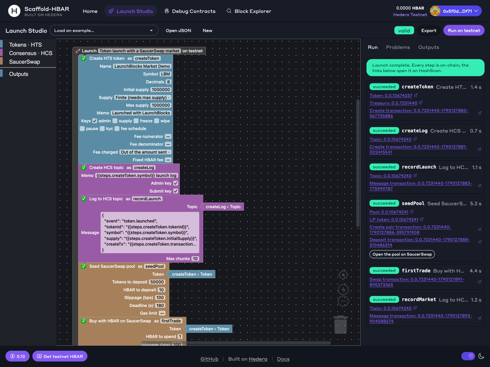
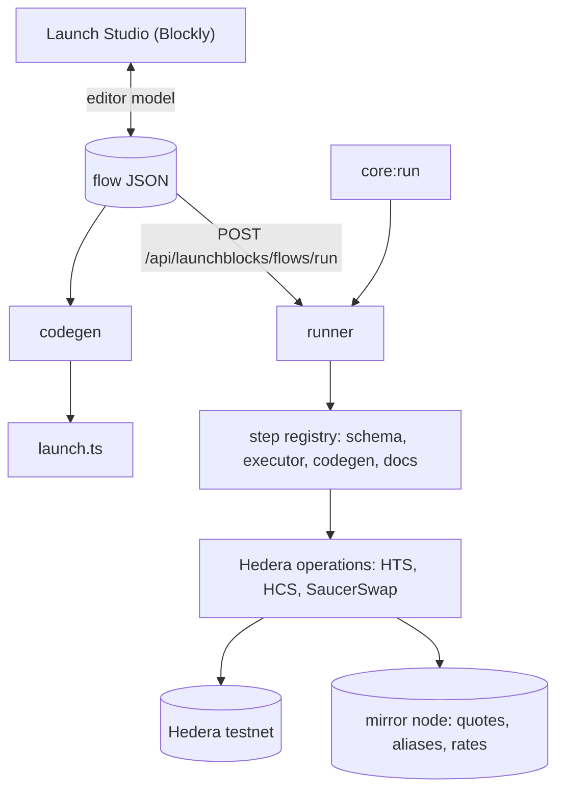
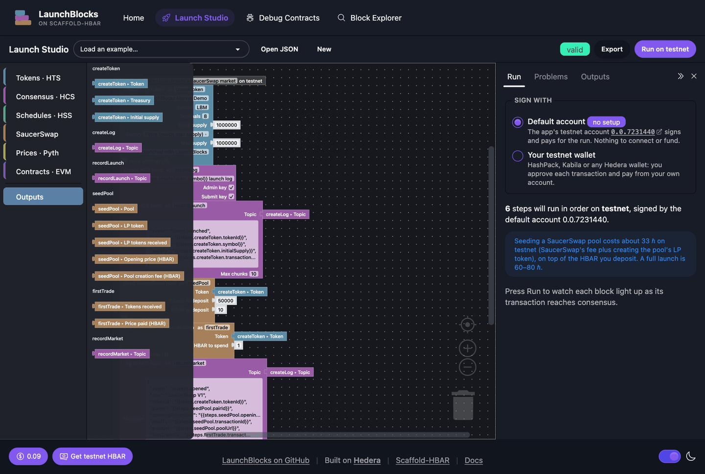

# LaunchBlocks — a visual token launchpad for Hedera

[](https://github.com/jmgomezl/scaffold-hbar-launchblocks/actions/workflows/ci.yaml)
[](LICENSE)


A [Scaffold-HBAR](https://docs.hedera.com/solutions/tools/scaffold-hbar/index) template for launching a token and giving it a market in one go. Snap blocks together — **create an HTS token → open a public HCS launch log → seed a SaucerSwap pool → make the first trade** — press Run, and watch each block turn green as its transaction reaches consensus. The same launch runs from the terminal, exports as a standalone `launch.ts`, and is stored as a plain JSON file you can review and commit.

```bash
npm create scaffold-hbar@latest -- --template jmgomezl/scaffold-hbar-launchblocks
```



## What you get

- **Launch Studio** (`/launch`) — a block editor in the style of App Inventor. ID inputs are sockets: type an id, or drag in an output from an earlier step, such as `createToken ▸ Token`. Problems show up on the block they belong to; runs stream live.
- **Flows as JSON** — the editor, the CLI and the API all run the same document. Nothing the editor can do is missing from the JSON.
- **A SaucerSwap integration that gets the details right** — exact opening prices, the EVM-alias recipient, fee conversion, measured gas limits. See [what makes it hard](#the-saucerswap-integration).
- **Nine step types** across HTS, HCS, smart contracts and the mirror node, each one schema-checked, documented, tested, and exportable as code.
- **A terminal runner** with dry runs, code generation, and a JSON record of every run, plus `core:doctor`, which checks your operator account before you spend anything.
- **Guards for a public demo** — mainnet stays off unless you turn it on, plus an optional run token and a per-client rate limit.

## Verified on testnet

A single run of the gallery flow `hts-launch-saucerswap`, started from the Launch Studio. Every id below can be checked independently: the launch log on HCS records all of them.

| What | Where |
| --- | --- |
| Token `LBM` (1,000,000 supply, 8 decimals) | [0.0.10674237](https://hashscan.io/testnet/token/0.0.10674237) |
| HCS launch log | [0.0.10674240](https://hashscan.io/testnet/topic/0.0.10674240) — `token.launched`, `market.opened` |
| SaucerSwap V1 pool (10 ℏ + 50,000 LBM, opening price exactly 0.0002 ℏ) | [0.0.10674241](https://hashscan.io/testnet/contract/0.0.10674241) |
| Pool deposit | [0.0.7231440-1790127888-310486314](https://hashscan.io/testnet/transaction/0.0.7231440-1790127888-310486314) |
| First trade: 1 ℏ → 4,533.0544694 LBM, filled exactly at the quote | [0.0.7231440-1790127891-895373365](https://hashscan.io/testnet/transaction/0.0.7231440-1790127891-895373365) |

## Quick start

**You need:** Node.js ≥ 20.18.3, Git, and a Hedera testnet account with about 60 ℏ per full launch. Here is what one launch cost, measured from the mirror node's records of the verified run above:

| Part of the launch | ℏ |
| --- | --- |
| SaucerSwap pool creation (SaucerSwap's fee, creating the pool's LP token, gas) | 32.85 |
| HTS token creation | 12.82 |
| Deposit into the pool — stays yours as liquidity | 10.00 + 1.06 gas |
| First trade — you get the tokens | 1.00 + 0.20 gas |
| Router allowance, HCS topic and messages | 1.18 |
| **Total** | **≈ 59** |

Network fees are priced in USD, so the HBAR amounts move with the exchange rate (these were at about 7.7¢ per ℏ). The cheaper gallery flow, `hts-launch-basic`, has no pool and costs about 27 ℏ: its token carries a 1% fee, and a token with custom fees costs twice as much to create (26.02 ℏ measured, against 12.82 ℏ without).

1. **Scaffold the project** (the CLI asks which package manager to use; both work):

   ```bash
   npm create scaffold-hbar@latest -- --template jmgomezl/scaffold-hbar-launchblocks
   ```

2. **Fund an operator.** Create a testnet account at [portal.hedera.com](https://portal.hedera.com/) and top it up from the [faucet](https://portal.hedera.com/faucet).

3. **Configure it:**

   ```bash
   cp packages/nextjs/.env.example packages/nextjs/.env
   ```

   Set `HEDERA_OPERATOR_ID` and `HEDERA_OPERATOR_KEY`. If the key is raw hex rather than DER, also set `HEDERA_OPERATOR_KEY_TYPE` (`ecdsa` or `ed25519`).

4. **Check the setup before spending anything:**

   ```bash
   yarn core:doctor
   ```

   This confirms the key parses, that it controls the account (it compares the public key with the one the mirror node reports), that the account exists on testnet, and that the balance is enough. It never prints the key.

5. **Launch.** From the terminal:

   ```bash
   yarn core:run hts-launch-saucerswap
   ```

   Or visually: start the app, open **Launch Studio**, and press **Run on testnet**.

   ```bash
   yarn next:dev
   ```

   Then open [http://localhost:3000/launch](http://localhost:3000/launch).

To try it without spending, `yarn core:run hts-launch-saucerswap --dry-run` validates the flow and lists the steps. With npm, put `--` before script arguments so npm does not take the flags itself: `npm run core:run -- hts-launch-saucerswap --dry-run`.

## Environment variables

All live in `packages/nextjs/.env` and are read on the server only. None of them is prefixed `NEXT_PUBLIC_`, so none can reach the browser.

| Variable | Required | Default | What it is |
| --- | --- | --- | --- |
| `HEDERA_OPERATOR_ID` | yes | — | The account that pays for and signs every step, e.g. `0.0.1234567`. It becomes the token treasury and holds every key it enables. |
| `HEDERA_OPERATOR_KEY` | yes | — | That account's private key. DER (as issued by the Portal) or raw hex. |
| `HEDERA_OPERATOR_KEY_TYPE` | for raw hex keys | — | `ecdsa` or `ed25519`. Raw hex does not say which curve it is; DER does. |
| `HEDERA_NETWORK` | no | `testnet` | `testnet`, `mainnet` or `localnet`. SaucerSwap steps need testnet or mainnet. |
| `HEDERA_MIRROR_URL` | no | per network | Override the mirror node base URL. |
| `LAUNCHBLOCKS_ALLOW_MAINNET` | no | `false` | The run API refuses mainnet flows unless this is exactly `true`. |
| `LAUNCHBLOCKS_RUN_TOKEN` | no | — | If set, runs through the API need an `x-launchblocks-token` header; the studio asks for it. |
| `LAUNCHBLOCKS_RUNS_PER_HOUR` | no | `20` | Per-client run limit for a public deployment; `0` turns it off. |

## How it works



A **flow** is an ordered list of steps. Each step has a `type`, a camelCase `id`, and `params`. A param can use an earlier step's output with `{{steps.<id>.<key>}}`: a param that is exactly one reference keeps the output's type, and a reference inside longer text is interpolated.

```json
{
  "schemaVersion": 1,
  "id": "hts-launch-saucerswap",
  "name": "Token launch with a SaucerSwap market",
  "network": "testnet",
  "steps": [
    { "id": "createToken", "type": "hts.createToken", "params": { "name": "LaunchBlocks Market Demo", "symbol": "LBM" } },
    { "id": "seedPool", "type": "saucerswap.createPool",
      "params": { "tokenId": "{{steps.createToken.tokenId}}", "tokenAmount": "50000", "hbarAmount": "10" } }
  ]
}
```

Before anything runs, the flow is checked from end to end. That covers the document's shape, every step's params against its schema, and the **wiring**: each reference must point at an earlier step, name an output that step actually produces, and give a value the receiving param accepts. That last check runs each step's example output through the next step's schema, so feeding a number into a token id is caught before any HBAR is spent.

**Packages**

| Package | What it holds |
| --- | --- |
| `packages/launchblocks` | The core, with no framework: flow schema, step registry, runner, codegen, Hedera and SaucerSwap operations, the terminal scripts, and ~300 unit tests. `@sh/launchblocks/editor` is its browser entry, and a test keeps zod and the Hedera SDK out of it. |
| `packages/nextjs` | The Launch Studio (`app/launch`), API routes (`app/api/launchblocks`), and the Scaffold-HBAR app shell. |
| `packages/hardhat` | The starter's contracts, tests and deploy scripts. |

**API routes** (all under `/api/launchblocks`): `GET steps` (catalog with a JSON Schema for each step), `GET gallery`, `POST flows/validate`, `POST flows/codegen`, `POST flows/run` (the full result, or NDJSON events with `Accept: application/x-ndjson`).

## Steps

Generated from the step definitions with `yarn core:docs`; CI fails if this table falls out of date.

<!-- launchblocks:steps:start -->
| Step | What it does | Services | Inputs | Outputs other steps can use |
| --- | --- | --- | --- | --- |
| `hts.createToken` | Create a fungible HTS token with configurable keys, supply type and custom fees. | HTS | `name`, `symbol`, `decimals`, `initialSupply`, `supplyType`, `maxSupply`, `memo`, `keys.admin`, `keys.supply`, `keys.freeze`, `keys.wipe`, `keys.pause`, `keys.kyc`, `keys.feeSchedule`, `fractionalFee.numerator`, `fractionalFee.denominator`, `fractionalFee.assessment`, `fixedHbarFee.amountHbar` | `tokenId`, `treasuryAccountId`, `transactionId`, `symbol`, `decimals`, `initialSupply` |
| `hts.mint` | Mint additional supply into the treasury (requires the supply key). | HTS | `tokenId`, `amount` | `tokenId`, `transactionId`, `newTotalSupply` |
| `hts.transfer` | Transfer tokens from the treasury to an associated account. | HTS | `tokenId`, `to`, `amount`, `memo` | `to`, `transactionId` |
| `hts.airdrop` | Airdrop tokens to early supporters without requiring association (HIP-904). | HTS | `tokenId`, `recipients`, `memo` | `transactionId`, `recipientCount`, `pendingCount` |
| `hts.associate` | Associate the operator with an existing token; a no-op if already associated. | HTS | `tokenId` | `accountId`, `transactionId` |
| `hcs.createTopic` | Create an HCS topic as the launch's public, ordered, timestamped log. | HCS | `memo`, `adminKey`, `submitKey` | `topicId`, `transactionId` |
| `hcs.submitMessage` | Append a text or JSON message to a topic, with consensus timestamp and sequence number. | HCS | `topicId`, `message`, `maxChunks` | `topicId`, `sequenceNumber`, `transactionId` |
| `saucerswap.createPool` | Create the token's first SaucerSwap V1 liquidity pool against HBAR, making it tradeable. | HTS, SmartContract, MirrorNode, SaucerSwap | `tokenId`, `tokenAmount`, `hbarAmount`, `slippageBps`, `deadlineSeconds`, `gasLimit` | `pairId`, `lpTokenId`, `liquidity`, `createPairTransactionId`, `transactionId`, `openingPriceHbar`, `creationFeeHbar` |
| `saucerswap.swap` | Buy the token with HBAR through its SaucerSwap V1 pool, proving the market is live. | HTS, SmartContract, MirrorNode, SaucerSwap | `tokenId`, `hbarAmount`, `slippageBps`, `deadlineSeconds`, `gasLimit` | `transactionId`, `tokensOut`, `effectivePriceHbar` |
| `contract.deploy` | Deploy a Hardhat-compiled contract to Hedera, with constructor arguments and token slots. | SmartContract, MirrorNode | `contract`, `arg1`, `arg2`, `arg3`, `arg4`, `autoAssociations`, `gas`, `initialHbar`, `adminKey` | `contractId`, `accountId`, `transactionId` |
| `contract.call` | Call a contract function: views and pure functions for free through the mirror node, others as a transaction. | SmartContract, MirrorNode | `contractId`, `function`, `arg1`, `arg2`, `arg3`, `arg4`, `payableHbar`, `gas` | `result`, `transactionId` |
<!-- launchblocks:steps:end -->

In the studio, the Outputs drawer lists what each step produces. Drag an output onto any id socket that accepts it:



## The SaucerSwap integration

Creating a pool and trading against it takes about twenty lines of SDK calls. Getting them right took measurements on testnet. Each point below is handled for you by `saucerswap.createPool` and `saucerswap.swap`, and each one came from a real failed run.

1. **LP tokens and swap outputs must go to the account's EVM alias.** Most code passes `AccountId.toSolidityAddress()`, the long-zero form (`0x…6e57d0`). For an account created from an ECDSA alias, the contracts accept it all the way until the final transfer: the pair is deployed, it is funded, the LP tokens are minted, and then the payout fails with `INVALID_ALIAS_KEY`. The revert only says `Safe token transfer failed!`. The real status shows up only in the transaction's child records (`/api/v1/transactions/<id>`). Both steps look up the alias with the mirror node first.

2. **The opening price is exact because the pool is created in two calls.** The router's one-call `addLiquidityETHNewPool` deposits everything in `msg.value` beyond the creation fee it works out at consensus. That fee is priced in *tinycents* and converted at the exchange rate in effect at that moment, which the caller can only estimate. On testnet, the mirror node's `current_rate` had expired and consensus used its `next_rate`, so one run deposited 10.32 ℏ instead of 10 and opened 3.2% high. The step instead calls `factory.createPair` with the fee quoted at the higher of the two listed rates plus a 2% buffer. The factory sends any excess to SaucerSwap's rent payer, never to the pool, and a short fee reverts before anything is deposited. Then `router.addLiquidityETH` deposits exactly the amounts you asked for.

3. **The documented gas is too low.** SaucerSwap documents 3,200,000 for pool creation. Measured on testnet: `createPair` 5,849,994, the one-call path 6,788,255, and the deposit 974,522. With too little gas, the contracts' guard messages (`Safe multiple associations failed!`, then `Safe single association failed!`) appear after about 98% of the limit is spent. The defaults are set from these measurements.

4. **The mirror node trails consensus.** A pool read, or a swap quote simulated on the mirror node straight after the deposit, still sees the old state. Reads that follow a write retry until the mirror catches up. Every quote comes from the router's own `getAmountsOut` through the mirror node's free `eth_call`, so quoting never costs HBAR and uses exactly the maths the swap will.

The integration also refuses to create a pool that already exists, grants the router an allowance through the token's ERC-20 facade (the approval SaucerSwap's own front end asks users to sign), and resolves pair contract ids through the mirror node, because pairs are deployed with CREATE2 and their addresses cannot be derived from the id arithmetically.

## Hedera services used

- **Token Service (HTS):** fungible tokens with configurable admin, supply, freeze, wipe, pause, KYC and fee-schedule keys; finite or infinite supply; fractional and fixed-HBAR custom fees; minting; transfers; HIP-904 airdrops, which also reach accounts that have not associated the token; association; allowances.
- **Consensus Service (HCS):** a topic per launch as a public, ordered, timestamped log, with messages in text or JSON and chunking up to 20 KB.
- **Smart contracts:** SaucerSwap V1 factory and router, called with `ContractExecuteTransaction`, plus each token's ERC-20 facade.
- **Mirror node:** free read-only contract calls for quotes and pool lookups, account and key verification, EVM alias resolution, exchange rates, and reading the launch log back.

## Scripts

| Command | What it does |
| --- | --- |
| `yarn core:doctor` | Check the operator (key, account, network, balance) without spending anything. |
| `yarn core:run <flow.json \| gallery-id>` | Run a flow. Add `--dry-run` to validate only, `--codegen out.ts` to write the script. Each run's full result is saved under `packages/launchblocks/runs/`. |
| `yarn next:dev` | Start the app with the Launch Studio at `/launch`. |
| `yarn core:test` | The core unit tests (vitest). No network. |
| `yarn core:docs` | Regenerate the step table in this README. |
| `yarn core:harness <flow.json>` | Export a flow as a [Hedera Harness recipe](#export-any-launch-as-a-recipe) into `.harness/`, the same files as the studio's **Export → Harness recipe**. |
| `yarn harness:doctor` · `yarn harness:validate` · `yarn harness:run` | The [Hedera Harness recipe](#extending-it-with-hedera-harness). |
| `yarn lint` · `yarn check-types` · `yarn test` | Everything, across packages. |

Gallery flows live in `packages/launchblocks/flows/`: `hts-launch-saucerswap` (the full launch) and `hts-launch-basic` (token with a 1% fee, HCS log and reserve mint; no pool, about 27 ℏ).

With npm, put `--` before script arguments: `npm run core:run -- <flow> --dry-run`.

## Adding a step type

Each step is one file under `packages/launchblocks/src/steps/<namespace>/`. The file holds the step's zod input and output schemas, an example output, editor fields, docs, the executor, and codegen. Register it in `src/steps/index.ts` and it appears in the registry, the API and the Launch Studio toolbox with no frontend changes; `yarn core:docs` adds it to this README's step table. A contract test checks every shipped step: its example output must be valid, its editor fields must exist in its schema, it must have docs, and its generated code must parse. [AGENTS.md](AGENTS.md) walks a coding agent through it.

## Extending it with Hedera Harness

`.harness/` is a [hedera-harness](https://github.com/hedera-dev/hedera-harness) recipe. It asks a coding agent to add a **Burn tokens** step (`hts.burn`) by following [AGENTS.md](AGENTS.md), then checks the result itself:

| Tier | Check |
| --- | --- |
| 0–1 | The step, operation, tests and gallery flow exist where AGENTS.md puts them; tests, lint, strict types, the README docs check, a dry run of the new flow, and the production build all pass. |
| 2 | The app boots; `/`, `/launch` and the step and gallery APIs render. |
| 3 | In the running studio, **Burn tokens** is in the toolbox, the new example loads as valid, and export generates the call. |
| 3.5 | The new flow burns supply **on testnet**, run as the harness's funded throwaway account. That account is passed to the flow runner only through environment variables. |

The validators were checked in both directions. On the template as shipped they fail with 15 findings, all about the missing step. On a correct implementation they pass with none, and the on-chain check burned real supply. Details, and how to run it, are in [.harness/README.md](.harness/README.md).

```bash
yarn harness:doctor     # prerequisites and the recipe
yarn harness:validate   # Tiers 0–2, no agent
yarn harness:run        # the full agent run
```

### Export any launch as a recipe

A launch you build can become a recipe of its own. In the Launch Studio, **Export → Harness recipe** downloads it as a zip to unpack at the project root; `yarn core:harness <flow.json>` writes the same files from the terminal. The recipe asks a coding agent to add the launch to the gallery unchanged, then grades the work:

| Tier | Check |
| --- | --- |
| 0 | The copy in `packages/launchblocks/flows/` and its gallery entry exist, with the exported ids and step types. No env files. |
| 1 | Core tests (which validate every gallery flow and round-trip it through the editor), lint and types; the copy is exactly the export; a dry run by gallery id; the production build. |
| 2 | The app boots, and `/launch?example=<id>` renders. |
| 3 | The studio lists the example and loads it as valid, the gallery API lists it, and its export has one section per step. |
| 3.5 | For testnet flows, the launch runs **on testnet** by its gallery id, as the harness's funded throwaway account. |

The spec funds that account from a cost estimate: measured fees per step type, plus the HBAR the flow hands over to pools and swaps, times three attempts with 25% headroom. The harness sweeps back what is left. The files go to `.harness/<flow-id>.spec.yaml` and `.harness/<flow-id>/`, beside the template's own recipe, because the harness takes a spec's parent directory as the project root. A flow that is already a gallery example is refused; rename the launch first.

This was checked with the real harness on the basic flow under a new name, `treasury-launch`. `validate` failed with 6 findings before the flow was in the gallery, all about the missing copy and its registration, and passed with none after, Playwright gate included. The Tier 3.5 command ran the flow on testnet as signer: token [`0.0.10676025`](https://hashscan.io/testnet/token/0.0.10676025), 26.42 ℏ in fees against an estimate of 26.7 ℏ.

```bash
yarn core:harness my-launch.json                            # or Export → Harness recipe in the studio
npx hedera-harness validate .harness/my-launch.spec.yaml    # Tiers 0–2, no agent
npx hedera-harness run .harness/my-launch.spec.yaml         # the agent, then every tier
```

## Deploying the studio

The app is a standard Next.js server; flows run in its API routes with the operator key from the environment. For a public demo:

- Leave `LAUNCHBLOCKS_ALLOW_MAINNET` unset, and consider `LAUNCHBLOCKS_RUN_TOKEN`: every run spends the operator's HBAR.
- Behind nginx, keep response buffering off for `/api/launchblocks/flows/run`. The route already sends `X-Accel-Buffering: no` so run events stream.
- Runs can take 30 s; the route allows up to 120 s.

## Troubleshooting

| Symptom | Cause and fix |
| --- | --- |
| `OPERATOR_MISSING` | `HEDERA_OPERATOR_ID` or `HEDERA_OPERATOR_KEY` is empty. Run `yarn core:doctor`. |
| `INVALID_SIGNATURE`, or doctor says the key does not control the account | Wrong key for the account, or a raw hex key read as the wrong curve. Set `HEDERA_OPERATOR_KEY_TYPE`. |
| `INSUFFICIENT_PAYER_BALANCE` | Top up at the [faucet](https://portal.hedera.com/faucet). A full launch needs about 60 ℏ. |
| `Safe token transfer failed!` from a SaucerSwap contract | Almost always a long-zero recipient for an alias account (see [the integration](#the-saucerswap-integration)). Check the transaction's child records for the real status. |
| `Safe multiple associations failed!` | Out of gas inside the pool contracts. Raise the step's gas limit. |
| `Could not quote HBAR → …` straight after creating a pool | The mirror node has not caught up yet. The swap step retries; if you call the operations directly, wait a few seconds. |
| `POOL_EXISTS` | That token already has a SaucerSwap pool against HBAR. Trade against it with `saucerswap.swap`. |
| npm install fails with `ERESOLVE` | Make sure the root `.npmrc` (`legacy-peer-deps=true`) came with the scaffold; npm workspaces read only the root file. |

## Security notes

- The operator key stays on the server. It is never logged or returned by the API, and `core:doctor` prints only whether it is set and its length.
- The operator is the treasury and holds every key it enables, so a flow never needs a second signer. The flip side: anyone who can reach an unguarded run endpoint can spend its HBAR. Use the run guards.
- The code is experimental and unaudited. It is built for testnet.

## Credits

MIT licensed. The monorepo layout, Scaffold-HBAR hooks and components, and the Hardhat package come from the Scaffold-HBAR blank starter (create-scaffold-hbar 0.4.0), itself derived from Scaffold-ETH 2; see [LICENSE](LICENSE) for their notices. Pool and swap contracts are [SaucerSwap](https://www.saucerswap.finance/)'s; the block editor is built on [Blockly](https://developers.google.com/blockly).
